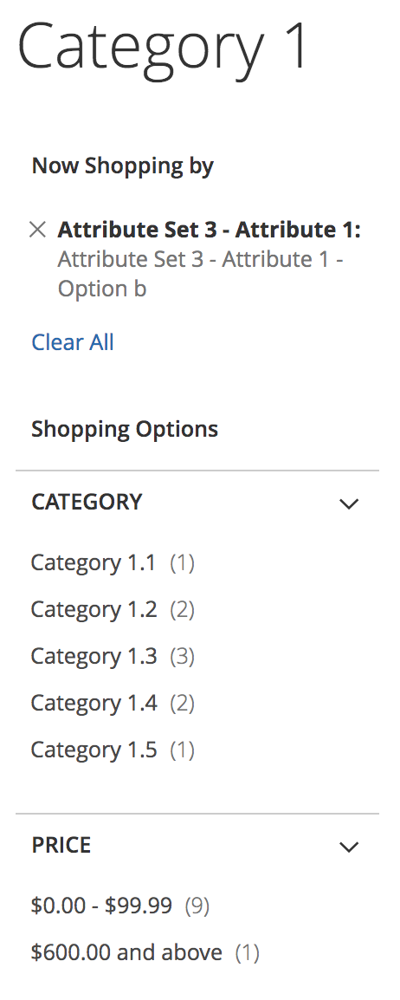

# Proposed changes for Product search and filtering

### Changes to Product filter input
**Current list of available filtering and sorting**

This list is currently hardcoded in the GrahpQl schema, we will be removing this list and using a dynamic list of attributes.

*Notable: We will remove the ability to combine conditions using "or".*

```
name: FilterTypeInput
sku: FilterTypeInput
description: FilterTypeInput
short_description: FilterTypeInput
price: FilterTypeInput
special_price: FilterTypeInput
special_from_date: FilterTypeInput
special_to_date: FilterTypeInput
weight: FilterTypeInput
manufacturer: FilterTypeInput
meta_title: FilterTypeInput
meta_keyword: FilterTypeInput
meta_description: FilterTypeInput
image: FilterTypeInput
small_image: FilterTypeInput
thumbnail: FilterTypeInput
tier_price: FilterTypeInput
news_from_date: FilterTypeInput
news_to_date: FilterTypeInput
custom_layout_update: FilterTypeInput
min_price: FilterTypeInput
max_price: FilterTypeInput
category_id: FilterTypeInput
options_container: FilterTypeInput
required_options: FilterTypeInput
has_options: FilterTypeInput
image_label: FilterTypeInput
small_image_label: FilterTypeInput
thumbnail_label: FilterTypeInput
created_at: FilterTypeInput
updated_at: FilterTypeInput
country_of_manufacture: FilterTypeInput
custom_layout: FilterTypeInput
gift_message_available: FilterTypeInput
or: ProductFilterInput
```

**New available filter options (On fresh Magento installation)**
```
category_id: FilterEqualTypeInput
description: FilterLikeTypeInput
name: FilterLikeTypeInput
price: FilterRangeTypeInput
short_description: FilterLikeTypeInput
sku: FilterLikeTypeInput
(Additional custom attributes): (filter type determined by attribute type)
```

Additionally FilterTypeInput will be replaced with more specific filter types that limit the types of comparisons that can be done based on the attribute type.
**Existing filter type**
```
FilterTypeInput:
eq | String
finset | [String]
from | String
gt | String
gteq | String
in | [String]
like | String
lt | String
lteq | String
moreq | String
neq | String
notnull | String
null | String
to | String
nin | [String]
```
**New filter types**
```
FilterEqualTypeInput (eq: String | in: [String])
FilterLikeTypeInput (eq: String | like: String)
FilterRangeTypeInput (from: String | to: String)
```

## Changes to Product sort input

**Current sort options**

Similar to filtering this hardcoded list will be replaced with a dynamic list of attributes that can be used for sorting.
```
name: SortEnum
sku: SortEnum
description: SortEnum
short_description: SortEnum
price: SortEnum
special_price: SortEnum
special_from_date: SortEnum
special_to_date: SortEnum
weight: SortEnum
manufacturer: SortEnum
meta_title: SortEnum
meta_keyword: SortEnum
meta_description: SortEnum
image: SortEnum
small_image: SortEnum
thumbnail: SortEnum
tier_price: SortEnum
news_from_date: SortEnum
news_to_date: SortEnum
custom_layout_update: SortEnum
options_container: SortEnum
required_options: SortEnum
has_options: SortEnum
image_label: SortEnum
small_image_label: SortEnum
thumbnail_label: SortEnum
created_at: SortEnum
updated_at: SortEnum
country_of_manufacture: SortEnum
custom_layout: SortEnum
gift_message_available: SortEnum
```

#### New available sort options (on fresh Magento installation)
```
name: SortEnum
position: SortEnum
price: SortEnum
(addition attributes that are availabled to use for sorting)
```

## Changes to Layered Navigation Output

Currently the schema for layered navigation is very specific to how you would render it in Luma and magento internal attributes. It doesn't make a lot of sense for GraphQl.



**Use cases:**
- Reading relevant filters after a product search and displaying them
- The UI logic has to be able to loop through attributes and list them as sections
- Each attribute has multiple and at least one value to be rendered. A value of an attribute can then be used to be filtered by in a product search, by using it's ID value where it's label is only used for display purposes.


**Current schema:**

- Query and return value:
```graphql
filters {
      filter_items_count
      name
      request_var
      filter_items {
        items_count
        label
        value_string
      }
    }
```


**Problems in the current schema:**

- `filters->name` it's actually the filter label intended for display and rendering 
- `filters->request_var` it's actually the filter name used in product filtering. this is not a HTTP request anymore, it's graphql.
- `filters->filter_items->value_string` it's actually the comparison ID value that we use in product filtering. Indeed is a string type for now because all attributes are. We don't make that distinction and when we will the 'value_string' won't make any sense.

It is used as:
```graphql
     products(
         filter: {
           request_var: {eq: "value_string"}
         }
     }
```

**Proposed schema:**

We will deprecate the `filters` return object and replace it with `aggregations`

```graphql
aggregations {
      count
      label
      attribute_code
      options {
        count
        label
        value
      }
    }
```


**Example output**

```graphql
"aggregations": [
        {
          "count": 2,
          "label": "Price",
          "attribute_code": "price",
          "options": [
            {
              "count": 3,
              "label": "*-100",
              "value": "*_100"
            },
            {
              "count": 2,
              "label": "100-*",
              "value": "100_*"
            }
          ]
        },
        {
          "count": 6,
          "label": "Category",
          "attribute_code": "category_id",
          "options": [
            {
              "count": 5,
              "label": "Category 1",
              "value": "3"
            },
            {
              "count": 1,
              "label": "Category 1.1",
              "value": "4"
            },
            {
              "count": 1,
              "label": "Category 1.1.2",
              "value": "6"
            },
          ]
        },
      ],
``` 

Example Query:
```graphql
{
  products(
    filter: {
      category_id: {eq:"3" }
      mysize: {eq:"17" }
    }
  	pageSize:10
    currentPage:1
    sort: {
      name :ASC
    }
  ) {
    items {
      sku
      name
    }
    aggregations {
      count
      label
      attribute_code
      options {
        count
        label
        value
      }
    }
    page_info {
      current_page
      page_size
      total_pages
    }
    total_count
    items {
      sku
      url_key
    }
  }
}

```
