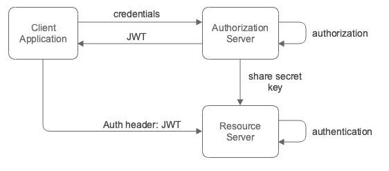

# Support of JWT authentication out-of-box

## Overview

JSON Web Token (JWT) is an open standard ([RFC 7519](https://tools.ietf.org/html/rfc7519)) that defines a compact and self-contained way for securely transmitting information between parties as a JSON object. This information can be verified and trusted because it is digitally signed (also, can be encrypted). JWTs can be signed using a secret (with the HMAC algorithm) or a public/private key pair using RSA or ECDSA.

The main use cases of JWT usage:

#### User authorization


JWT contains user's "session" representation. After successful login, all user session data (like ID, permissions, etc.) is stored in JWT token and user's permissions and allowed operations can be verified just based on information from JWT.

#### API authorization



Allows for client application to make API calls to needed resource with JWT as authorization token. The resource application can verify needed permissions from JWT claims. Authorization server can be separate application or the as resource server. In first case, the resource application should retrieve the secret key from the authorization server or send JWT to the authorization server for the verification.

#### Data exchange


Allows to built communication between multiple servers. An authorization server shares secret keys between servers or servers can send JWT to the authorization server for the future verification.

#### Data verification


Allows to verify if data is received from trusted source. The diagram shows RSA keys usage for content encryption but different types of keys can be used for the data verification like octet strings, key files, X.509 Certificates, etc.

The JWT structure has three main parts:

 - `header` - contains information about signature verification algorithms
 - `payload` - contains data (JWT-claims), the RFC defines a list of standard optional claims (https://tools.ietf.org/html/rfc7519#section-4.1)
 - `signature` - is used for data verification and represented as a hash of encoded `header` and encoded payload and secret key

And in general JWT looks like this: `header`.`payload`.`signature`.

The JWT usage became more and more popular for authentication and data verification purposes and Magento has a lot of integrations with different 3rd party systens, we should support JWT creation/validation/parsing out-of-box. Another benefit, that JWT is language agnostic and token generaten with one programming language can be parsed with another, the only key should be shared between applications.

## Solution

We do not need to implement own solution for key generation, parsing tokens, encryption/decryption, etc. [There are](https://jwt.io/#libraries) multiple PHP libraries which support all needed operations and algorithms and we need to create own wrappers.

[PHP JWT Framework](https://github.com/web-token/jwt-framework) - is proposed as a library because:
 - implements all algorithms from RFC
 - provides implementation for JWS, JWT, JWE, JWA, JWK, JSON Web Key Thumbprint, Unencoded Payload Option
 - supports different serialization modes
 - supports multiple compression methods
 - full support of JSON Web Key Set
 - has a good documentation
 - supports detached payload, multiple signatures, nested tokens

## Implementation

The following diagram represents needed interfaces to unify the workflow for JWT usage.


The `\Magento\Framework\Jwt\KeyGeneratorInterface` will provide a possibility to use different types of key generators like: Magento deployment secret key, X.509 certificates or RSA keys.
```php
interface KeyGeneratorInterface
{
    public function create(): JWK;
}

class CryptKeyGenerator implements KeyGeneratorInterface
{
    public function __construct(AlgorithmFactory $algorithmFactory, DeploymentConfig $deploymentConfig)
    {
        $this->algorithmFactory = $algorithmFactory;
        $this->deploymentConfig = $deploymentConfig;
    }

    public function create(): JWK
    {
        $secret = (string) $this->deploymentConfig->get('crypt/key');
        return JWKFactory::createFromSecret(
            $secret,
            ['alg' => $this->algorithmFactory->getAlgorithmName(), 'use' => 'sig']
        );
    }
}
```

The `\Magento\Framework\Jwt\GeneratorInterface` might be used to generate JWT based on claims:
```php
interface GeneratorInterface
{
    public function generate(array $claims = []): string;
}

class JwsGenerator implements GeneratorInterface
{
    public function __construct(
        AlgorithmFactory $algorithmFactory,
        CryptKeyGenerator $keyGenerator,
        SerializerInterface $serializer
    ) {
        $this->algorithmFactory = $algorithmFactory;
        $this->keyGenerator = $keyGenerator;
        $this->serializer = $serializer;
    }

    public function generate(array $claims = []): string
    {
        $timestamp = time();
        $baseClaims = [
            'iat' => $timestamp,
            'nbf' => $timestamp,
            'exp' => $timestamp + 36000,
            'use' => 'sig'
        ];

        $payload = json_encode(array_merge($claims, $baseClaims));

        $jwsBuilder = new JWSBuilder(null, $this->algorithmFactory->getAlgorithmManager());
        $jws = $jwsBuilder->create()
            ->withPayload($payload)
            ->addSignature($this->keyGenerator->create(), ['alg' => $this->algorithmFactory->getAlgorithmName()])
            ->build();

        return $this->serializer->serialize($jws);
    }
}
```
It will have implementations for JWS and JWE (the default preference will be for JWS implementation).

The `\Magento\Framework\Jwt\VerifierInterface` provides a possibility to validate received JWT. The implementation might use claims validation for more advanced payload verification.
```php
interface VerifierInterface
{
    public function validate(string $token): bool;
}

class JwsVerifier implements VerifierInterface
{
    public function __construct(
        AlgorithmFactory $algorithmFactory,
        KeyGeneratorInterface $keyGenerator,
        SerializerInterface $serializer,
        ClaimCheckerManagerFactory $checkerManagerFactory
    ) {
        $this->algorithmFactory = $algorithmFactory;
        $this->keyGenerator = $keyGenerator;
        $this->serializer = $serializer;
        $this->checkerManagerFactory = $checkerManagerFactory;
    }

    public function validate(string $token): bool
    {
        $verifier = $this->getVerifier();
        $jws = $this->serializer->unserialize($token);

        if (!$verifier->verifyWithKey($jws, $this->keyGenerator->create(), 0)) {
            return false;
        };

        $checkers = ['iat', 'nbf', 'exp'];
        $claimChecker = $this->checkerManagerFactory->add('iat', new IssuedAtChecker())
            ->add('nbf', new NotBeforeChecker())
            ->add('exp', new ExpirationTimeChecker())
            ->create($checkers);

        $payload = json_decode($jws->getPayload(), true);

        try {
            $claimChecker->check($payload, $checkers);
        } catch (InvalidClaimException | MissingMandatoryClaimException $e) {
            throw new \InvalidArgumentException($e->getMessage());
        }

        return true;
    }
}
```

The [POC](https://github.com/joni-jones/magento2/tree/jwt-auth) replaces the usage of standard WEB API access tokens by JWT and shows how the wrappers and their usage might look like.
